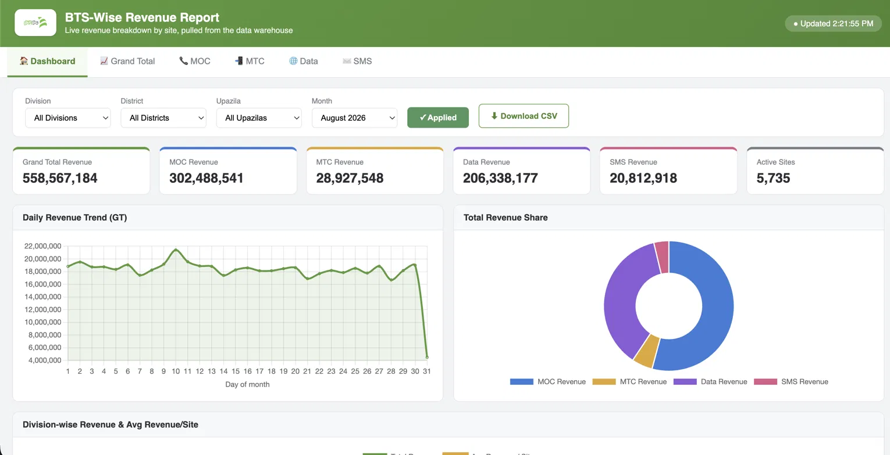
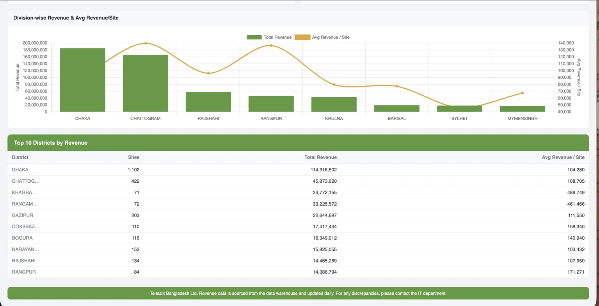
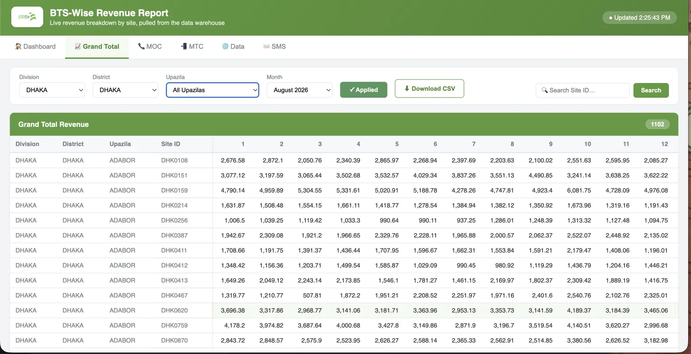
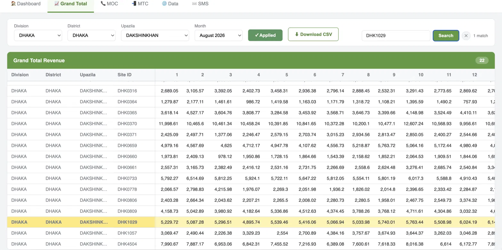

# 📈 BTS-Wise Revenue Report — Web Portal

A live Flask + Oracle web portal that replaces a manual `BTS-Wise_Total_Revenue.xlsx` workbook with an on-demand SQL-backed report — Site × Day revenue pivots, KPI dashboard, filters, and CSV export.

---

## 📸 Screenshots

| Dashboard-upside view | Dashboard-downside view |
|---|---|
|  |  |
| Grand Total | Filter |
|  |  |

---

## ✨ Features

- **Site × Day revenue pivot** across 5 categories — GT (Grand Total), MOC, MTC, Data, SMS
- **Dynamic month columns** — day columns adapt automatically to 28/29/30/31-day months
- **Division / District / Month filters**, populated from live data (no hardcoded dropdown values)
- **Dashboard tab** — KPI cards, daily revenue trend, division/district breakdown (Chart.js)
- **CSV export** of whatever's currently filtered on screen
- **Cross-category caching** — switching tabs (GT → MTC → SMS → Data → MOC) for the same filters is instant after the first load; only one query hits Oracle per filter set
- **Connection pooling** (2–10 Oracle connections) instead of opening a new connection per request
- Loading / error / "applied filters" UI states, with request race-condition protection (stale responses are dropped if a newer request has already started)

## 📁 Project layout

```
revenue_portal/
├── app.py                     Flask routes
├── db.py                      Oracle pool + pivot query builder
├── cache.py                   Thread-safe in-memory TTL cache
├── config.py                  DB connection + category → column mapping
├── requirements.txt
├── templates/
│   └── revenue.html
└── static/
    ├── style.css               Green-white theme
    ├── app.js
    ├── chart.umd.min.js
    └── images/teletalk-logo.png
```

## 🚀 Setup

```bash
pip install -r requirements.txt
```

Set your Oracle credentials in `config.py` (`ORACLE_CONFIG['user']` / `['password']`), then run:

```bash
python app.py
```

Open **http://\<server\>:5002/**

> ⚠️ **Before this goes to GitHub / production:** `config.py` in this bundle has a placeholder DB user/password in it. Double-check it's not a real credential before committing, and if it is, rotate it and move it to an environment variable or `.env` file instead of hardcoding it — see [Security notes](#-security-notes) below.

## 🔌 API reference

| Route | Params | Returns |
|---|---|---|
| `GET /api/months` | — | Distinct months available (newest first) |
| `GET /api/filters` | — | Division / District dropdown options |
| `GET /api/revenue-report` | `category`, `month` (`YYYYMM`), `division`, `district` (optional) | Site × Day pivot table |
| `GET /api/revenue-report/csv` | same as above | CSV download |
| `GET /api/dashboard-summary` | `month`, `division`, `district` (optional) | KPI cards + trend + breakdowns |

## 🧮 Revenue column mapping

| Excel tab | Source column |
|---|---|
| MOC | `VOICE_REV_TOT_MOC` |
| MTC | `VOICE_REV_MTC` |
| Data | `DATA_REV_TOT` |
| SMS | `SMS_REV_TOT` |
| GT (Grand Total) | `VOICE_REV_TOT_MOC + VOICE_REV_MTC + DATA_REV_TOT + SMS_REV_TOT` |

Data source: `VOICE_DATA_DETAILS_FINAL_2`, joined to `ZONE_DIM_FULL` on `SITE_ID` for Division/District/Upazila geography (`LEFT JOIN`, so sites without a geography match still appear with blank fields rather than being dropped).

## ⚡ Performance notes

- Dashboard aggregates (totals / daily trend / division breakdown / district breakdown) run as **one** query using `GROUP BY GROUPING SETS`, instead of 4 separate scans.
- Both main queries filter on `MONTH_KEY` in addition to the date range, to take advantage of month-based partitioning if `VOICE_DATA_DETAILS_FINAL_2` is partitioned that way — worth confirming against `DBA_TAB_PARTITIONS`.
- The site-level pivot still scans the full month for every site (inherent to a Site × Day report). If this gets slow at scale, the next steps are a `PARALLEL` hint or a nightly pre-aggregated summary table.
- Cache is in-process memory — fine for a single worker, but would need something like Redis if scaled across multiple gunicorn workers.

## ⚠️ Known limitations / open items

- The Excel workbook's **Dashboard** tab also had `Total_Attach`, `BTS Number`, `Blended_ARPU`, and an operator-wise (Airtel/Banglalink/BTCL/Edotco/Robi/TBL) breakdown — none of that data lives in `VOICE_DATA_DETAILS_FINAL_2` or `ZONE_DIM_FULL`. Needs the source table identified before those specific figures can be added.
- Not yet load-tested against live Oracle at full data volume — recommend running `EXPLAIN PLAN` on the main queries once real data is flowing.

## 🔒 Security notes

- This repo currently has Oracle DB credentials hardcoded in `config.py`. **Before pushing to a public (or even shared internal) GitHub repo**, move these to environment variables or a `.env` file excluded via `.gitignore`, and rotate the password if it's a real one.

## 🛠️ Tech stack

- **Backend:** Flask, `oracledb`
- **Frontend:** Vanilla JS, Chart.js
- **Database:** Oracle